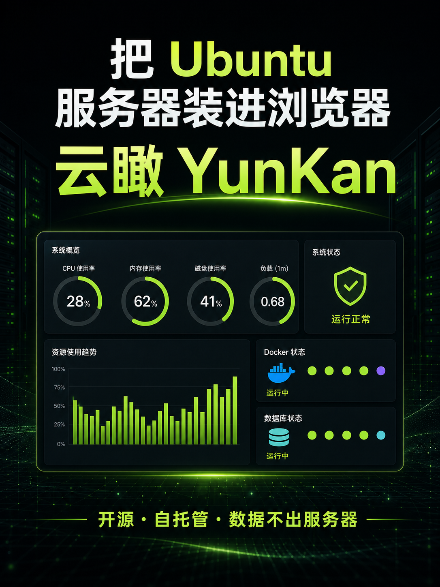

# 云瞰 YunKan

> 你的服务器，一眼看懂。

云瞰是一个面向独立开发者和 Vibe Coding 用户的轻量服务器可视化面板。它把 Ubuntu 里难读的命令输出，变成一个干净、中文、能解释当前状态的浏览器仪表盘。



## 它能看什么

- CPU：使用率、核心数、系统负载与趋势
- 内存：已用/总量、Swap 使用情况
- 磁盘：空间占用与剩余容量
- 网络：实时上传/下载速度、TCP 连接数
- Docker：容器、镜像、端口与运行状态
- 数据库：自动识别 MySQL、MariaDB、PostgreSQL、Redis、MongoDB 容器
- 进程：CPU 占用最高的进程
- 健康结论：把指标翻译成“一切正常 / 需要关注 / 需要处理”

## 3 分钟安装

要求：Ubuntu 20.04+、Docker Engine 与 Docker Compose 插件。

```bash
git clone https://github.com/your-name/yunkan.git
cd yunkan
sh install.sh
```

浏览器访问：`http://你的服务器公网 IP:6121`

腾讯云轻量应用服务器需要在控制台的「防火墙」中放行 TCP `6121` 端口。公开到公网前，建议通过 Tailscale、Cloudflare Access 或 Nginx Basic Auth 增加访问控制。

## 更新与卸载

```bash
# 更新
git pull && docker compose up -d --build

# 停止
docker compose down
```

## 安全设计

- 采集器只读取 `/proc`、磁盘容量和 Docker 状态，不读取数据库业务数据。
- 默认不需要数据库账号、SSH 密钥或云厂商密钥。
- Docker Socket 以只读方式挂载；尽管如此，它仍是高权限接口，请勿运行来源不明的分支或镜像。
- 仪表盘默认无登录系统，建议只在私网使用，或在公网入口前添加鉴权。

## 项目结构

```text
app/                可视化仪表盘
collector/          零第三方 Python 依赖的 Linux 采集器
docker-compose.yml  一键部署编排
nginx.conf          同源网关，避免暴露采集端口
```

## 本地开发

```bash
npm install
npm run dev
```

没有连接采集器时，页面会自动显示演示数据，便于开发界面。完整联调使用 `docker compose up --build`。

## 路线图

- [ ] 温度、GPU 与磁盘 I/O
- [ ] 历史指标存储和 24 小时趋势
- [ ] 告警通知（飞书、企业微信、邮件）
- [ ] 登录与双因素认证
- [ ] 多服务器总览
- [ ] 可选的 MySQL/PostgreSQL 深度指标

欢迎提交 Issue 和 Pull Request。这个项目尤其欢迎第一次参与开源的朋友。

## License

MIT © 2026 YunKan contributors
